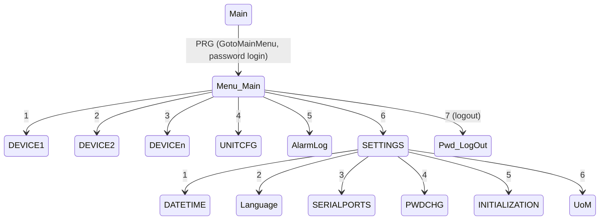

# PLC-ST

HMI application template for **Carel pCO / c.pCO (pCO5)** controllers, written in **Structured Text (ST, IEC 61131-3)** using the Carel development environment (1tool / c.suite).

`PLC-ST.st` is a top-level example/template that implements the machine terminal user interface logic: display masks, menus, password-protected access levels, alarm handling, languages, date/time, parameter import/export and memory maintenance.

The program is **not standalone**: it relies on the Carel "Applications" system framework, which provides ready-made masks, Loops, LEDs and alarms.

## Features

- **Masks and navigation** — state machine driven by the `MaskPos` variable, global ESC (`GlobalEsc`), automatic return to the main mask after a timeout (5 minutes) with automatic logout.
- **Quick Menu** — 3 items: `ONOFF`, `SET`, `INFO`, with blinking icons.
- **Main Menu** — 7 items: `DEVICE1`, `DEVICE2`, `DEVICEn`, `UNITCFG`, alarm log, settings, logout.
- **Settings Menu** — 6 items: date/time, language, serial ports, password change, initialization (memory wipe), units of measure (UoM).
- **Passwords and access levels** — User, Service, Manufacturer, plus "passe-partout" passwords (`RESERVED1` / `RESERVED2`); password change rights are controlled by the `EnPwdChgU` / `EnPwdChgS` / `EnPwdChgM` flags.
- **Alarms** — active alarm count, buzzer activation, LED 12 blinking, paging and scrolling, single reset (`ResetAlarm`, auto-repeat when held ≥ 3 s) and global reset (`ResetAlarms`).
- **Alarm logs** — log browsing (up to 64 records), jump to first/last entry, beep at the boundaries, log and auto-reset counter clearing.
- **Stored (sampled) variables** — 2 value slots per alarm/log entry (`GetAlarmStoredVar`, `GetAlarmLogStoredVar`).
- **Languages** — language selection, 30-second language mask timeout, `ChangeLanguage`.
- **Date and time** — DD/MM/YY, MM/DD/YY and YY/MM/DD formats (`GeneralMng.DateFormat`), time zone setup (`TZUp` / `TZDwn`, `SetTimeZone`).
- **Parameter import/export** — `ImpExpMng.En_ParamsImp` / `En_ParamsExp`, operation blocked while the unit is running (`UnitOn`).
- **Alarm export** — `GeneralMng.En_AlrmExp`.
- **Memory maintenance** — Wipe Retain / NVRAM / all (`GeneralMng.WipeMem[1] := 1 | 2 | 3`).
- **Unit on/off** — `OnOffUnitMng.KeybOnOff`.
- **Indication** — LED 7 (PRG) and LED 12 (Alarm): off / on / blinking (`SetLedStatus`); buzzer via `__SYSVA_MANUAL_BUZZER_ON` / `__SYSVA_MANUAL_BUZZER_OFF`.
- **Board temperature** — displays `GeneralMng.BoardTemp_Msk` (only for `BoardTyp = 12`, c.pCO).

## `PLC-ST.st` structure

| Block | Purpose |
| --- | --- |
| `VAR_GLOBAL` | Global variables: menu settings, positioning, passwords, alarms, date/time |
| `FUNCTION TIMED_LOOP` | Periodic loop (~1 s): alarms, timeouts, blinking, date format, UoM |
| Timed Loop Functions | `InstDef`, `CheckAlarm`, `ShowLangMskTime`, `BlinkQuickMenu`, `CarelLogo`, `RetMainMsk`, `MskDateFormat`, `UsrAccessMenu`, `CheckAlrm_Reset` |
| Language Management | `Lang_UP` |
| Active Alarms | `CheckActiveAlarm`, `ScrollAlarm_UP/DOWN`, `ResetSingleAlarm`, `ResetGlobalAlarm`, `CheckStoredVar_Alrm` |
| Alarms Logs | `gotoAlarmLog`, `ScrollAlarmLog_UP/DOWN`, `CheckStoredVar_Log`, `DeleteAlarmLog`, `ClearAutoResetCounter` |
| Quick Menu | `QuickMenuUP`, `QuickMenuDOWN`, `QuickMenuENT` |
| Main Menu | `GotoMainMenu`, `SelMainMenu`, `RetMainLoop` |
| Settings Menu | `GotoMain`, `SelSettingsMenu`, `RetSettingsLoop` |
| Navigation | `GlobalEsc`, `ScrollMenuDown`, `ScrollMenuUp` |
| Password Management | `PwdLogIn`, `PwdLogOut`, `ChgPwd`, `EscLogIn`, `DummyService`, `DummyManuf`, `DummyManufOnOff`, `IncrDig`, `DecrDig` |
| Import/Export, Alarm Export, Date, OnOff, other | `ParamImpExp`, `AlrmExp`, `EnDateChg`, `TZUp`, `TZDwn`, `OnOffSwitch`, `WipeMem`, `SetTimeZone`, `SetUoMZone_UI` |

## Mask navigation

## Customization

The number of menu items is configured in `VAR_GLOBAL`:

- `MAIN_MENU_ITEMS_NO` — main menu items (default 7);
- `SETTINGS_MENU_ITEMS_NO` — settings menu items (6);
- `QUICK_MENU_ITEMS_NO` — quick menu items (3).

Extension points:

- menu texts — mask classes `MainTxtTOP` / `MainTxtMIDDLE` / `MainTxtBOTTOM`, `SettingsTxtTOP` / `SettingsTxtMIDDLE` / `SettingsTxtBOTTOM`;
- icons — `IdxImgMain`, `IdxImgSettings`, `IdxImgQM`;
- selection handlers — functions `SelMainMenu`, `SelSettingsMenu`, `QuickMenuENT` (`CASE` statements).

## Usage

1. Open the project in the Carel environment (1tool / c.suite) and add `PLC-ST.st` to the application project.
2. Compile and download to a pCO / c.pCO (pCO5) controller, or run it in the simulator.
3. When simulating: in the **Mask Simulator** window press **Watch Variables** and set the `ID_Lang` variable to `-1` to skip the initial mask.

Tip: `CTRL+M+L` collapses all functions in the editor.

### Requirements

- Carel pCO / c.pCO (pCO5) controller or its simulator;
- Carel development environment (1tool / c.suite) with the "Applications" library (masks, Loops, alarms).

> `ID_Lang = -1` is used by the application as a flag that a Wipe Retain has just been performed: in that case the language selection mask is shown with a 30-second timeout.

## License

This project is released under the **MIT** License. See the [LICENSE](LICENSE) file for the full text.

    Copyright (c) 2026 Shahidsamadov
